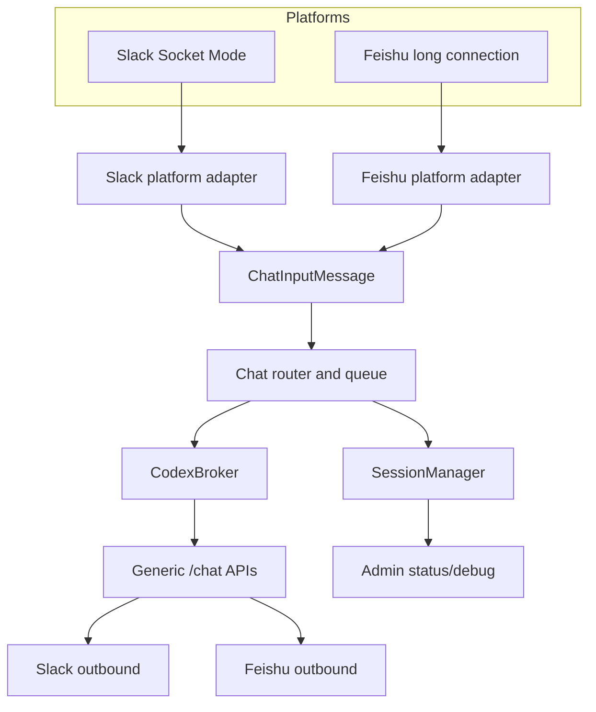

# RFC 0001 Deep Dive: Architecture and product contract

This file contains the implementation-facing architecture detail for [RFC 0001](../0001-slack-feishu-dual-platform.md). Keep the entry RFC short; update this file when data shapes, routing rules, or API contracts change.

## One-Screen Summary

| Decision area   | Current contract                                                                                                                                                                     |
| --------------- | ------------------------------------------------------------------------------------------------------------------------------------------------------------------------------------ |
| Product target  | China Feishu group support beside existing Slack; global Lark and Feishu private chats stay out of scope.                                                                            |
| Runtime shape   | Slack and Feishu share one broker process through platform-aware adapters, session coordinates, and `/chat/*` APIs.                                                                  |
| Session rule    | New session identity includes `platform`; legacy Slack keys remain readable and are never reinterpreted as Feishu.                                                                   |
| Feishu routing  | Group @bot starts/resumes; non-@ group follow-up needs an active session plus verified all-message delivery or bounded recovery; private/self/bot/app events do not create sessions. |
| Content rule    | Text, rich `post`, interactive cards, images, and files preserve enough structure/raw references for current behavior and later UX polish.                                           |
| Release blocker | Slack compatibility and platform isolation must remain provable while Feishu is added.                                                                                               |

## Read Layers

| Layer | Use when                                             | Expand                                                                        |
| ----- | ---------------------------------------------------- | ----------------------------------------------------------------------------- |
| 1     | You need the architecture decision in a few minutes. | Read this summary and the [entry RFC](../0001-slack-feishu-dual-platform.md). |
| 2     | You are reviewing product scope or routing.          | Expand "Product and architecture contract".                                   |
| 3     | You are implementing API/session/prompt code.        | Expand "Implementation-facing reference".                                     |
| 4     | You are debugging failure isolation.                 | Expand "Failure isolation".                                                   |

<details>
<summary>Layer 2: Product and architecture contract</summary>

## Problem

The current broker is Slack-shaped throughout the runtime. Slack assumptions appear in session identity, inbound message storage, post-message routes, Slack-specific prompts, worker ownership, and admin/debug surfaces.

Feishu adds different platform constraints:

- group messages and private chats have different event shapes and permissions;
- all-group-message delivery is permission-gated;
- message trees are not identical to Slack threads;
- rich text, cards, files, and callbacks are separate payload families;
- long connection delivery requires fast ack and queued work;
- real tenant setup is necessary to prove sensitive permissions.

The design must add Feishu without turning Slack into a compatibility afterthought.

## Goals

- [x] Slack and China Feishu can run simultaneously in one broker process.
- [x] Slack runtime behavior and Slack API compatibility remain intact.
- [x] Feishu group @bot events can start or resume Codex sessions.
- [x] Feishu private chat events are ignored and cannot create sessions.
- [x] Feishu non-@ group follow-ups can route to an active session when all-group-message delivery is available.
- [x] Feishu text, rich text, interactive card, image, and file messages preserve enough structured/raw data for current and future Codex formatting.
- [x] Operators can see per-platform health, degraded modes, and replay coordinates.

## Non-Goals

- [x] No Slack migration or Slack deprecation.
- [x] No Feishu private chat product support in the first implementation.
- [x] No global Lark support in the first implementation.
- [x] No guarantee that `at_only` mode has complete group context.
- [x] No guarantee that Feishu card callbacks work before the card phase.
- [x] No multi-worker Feishu event fan-out until leader election or a shared event queue exists.

## Non-Negotiable Invariants

- [x] Platform is part of every new session identity and inbound message identity.
- [x] Legacy Slack session keys remain readable.
- [x] Slack `/slack/*` routes continue to work as compatibility wrappers.
- [x] Feishu private chats never create sessions.
- [x] Feishu non-@ context is never promised unless all-group-message delivery has been verified or recovered from history.
- [x] Rich text and cards are never stored only as lossy flattened text.
- [x] One platform's startup or send failure must not hide the other platform's health.

## Requirement Matrix

| Requirement                 | Contract                                                             | Evidence                                        |
| --------------------------- | -------------------------------------------------------------------- | ----------------------------------------------- |
| China Feishu first          | `FEISHU_DOMAIN=feishu`; defer `lark`                                 | Config tests, setup docs, real smoke            |
| Bot identity                | At least one `FEISHU_BOT_*` identity is configured for @bot matching | Config tests, setup docs, preflight             |
| No private chats            | Ignore `chat_type != group`; no p2p session creation                 | Parser tests and mock e2e                       |
| All group messages          | Request `im:message.group_msg`; expose `all` vs `at_only`            | Permission checklist, admin health, non-@ smoke |
| Rich text + cards           | Preserve `post` and `interactive` raw payloads                       | Fixture, formatter, card callback tests         |
| Simultaneous Slack + Feishu | Platform-aware runtime and health                                    | Dual-platform mock e2e plus Slack regression    |

## Terminology

| Term             | Meaning                                                                                                    |
| ---------------- | ---------------------------------------------------------------------------------------------------------- |
| `platform`       | `slack` or `feishu`. Required on new shared contracts.                                                     |
| `conversationId` | Slack channel ID or Feishu chat ID.                                                                        |
| `rootMessageId`  | Platform root for a session: Slack `thread_ts` or Feishu root/message/thread coordinate chosen by adapter. |
| `messageId`      | Platform message identifier used for idempotency.                                                          |
| `sessionKey`     | Canonical key derived from `platform`, `conversationId`, and `rootMessageId`.                              |
| `all` mode       | Feishu mode expecting all group messages through `im:message.group_msg`.                                   |
| `at_only` mode   | Degraded Feishu mode assuming only @bot delivery.                                                          |

## Target Architecture



Runtime ownership:

- Platform adapters normalize inbound events and post outbound messages.
- Router/session code owns session creation, resume, stop, dedupe, queueing, and Codex turn routing.
- Codex runtime remains platform-neutral.
- Admin reports per-platform health and per-session coordinates.

Platform adapter contract:

```ts
interface ChatPlatformAdapter {
  platform: "slack" | "feishu";
  start(): Promise<PlatformHealthStatus>;
  stop(): Promise<void>;
  normalizeInbound(event: unknown): Promise<ChatInputMessage[]>;
  postMessage(request: ChatPostMessageRequest): Promise<ChatPostMessageResult>;
  getHistory?(request: ChatHistoryRequest): Promise<ChatHistoryResult>;
}
```

</details>

<details>
<summary>Layer 3: Implementation-facing reference</summary>

## Feishu Product Scope

Supported in MVP:

- [x] China Feishu self-built app.
- [x] Long connection event receive.
- [x] Group @bot text event creates or resumes a session.
- [x] Private chat event ignored.
- [x] Text replies to originating group/root message.
- [x] `-stop` in matching group session.
- [x] Raw message preservation for text, rich text, card, image, and file.
- [x] Explicit `all` vs `at_only` degraded mode.

Post-MVP but required product scope:

- [x] Rich text outbound formatting.
- [x] Interactive card outbound formatting.
- [x] Card callback routing.
- [x] Image/file upload and download.
- [x] Co-author confirmation through cards.
- [x] Per-chat throttling tuned against Feishu rate limits.

Explicitly unsupported in MVP:

- [x] Feishu private chats.
- [x] Global Lark.
- [x] Group administration workflows.
- [x] Multi-worker Feishu ingestion without a coordination design.

## Event Routing Rules

Inbound Feishu events should normalize into one of these routes:

| Event                                              | Route                                    | Session behavior                                                                                                              |
| -------------------------------------------------- | ---------------------------------------- | ----------------------------------------------------------------------------------------------------------------------------- |
| group @bot text                                    | `accepted_start_or_resume`               | Create or resume session                                                                                                      |
| group non-@ text in `all` mode with active session | `accepted_followup`                      | Queue or steer into active turn; if no Feishu root/thread coordinate matches, use the latest active session in the same group |
| group non-@ text without active session            | `ignored_no_active_session`              | No session                                                                                                                    |
| private chat                                       | `ignored_private_chat`                   | No session                                                                                                                    |
| bot/app/self message                               | `ignored_self`                           | No session                                                                                                                    |
| duplicate `message_id`                             | `deduped`                                | No duplicate turn/reply                                                                                                       |
| rich `post`                                        | `accepted_rich` when group route matches | Preserve raw payload and readable summary                                                                                     |
| interactive card callback                          | `accepted_card_callback`                 | Ack quickly, enqueue session action                                                                                           |

Rules:

- [x] Session creation requires explicit group @bot.
- [x] Non-@ follow-up requires an existing active session and all-message delivery or recovered history; rootless group follow-ups in `all` mode attach to the latest active session in the same group.
- [x] All callbacks must ack before Codex work runs.
- [x] Dedupe must prefer Feishu `message_id` for message events.

## History and Recovery

History recovery is bounded and permission-aware.

- [x] Store last observed cursor/message coordinate per Feishu session.
- [x] On restart, recover only bounded windows for active or recently active sessions, using `FEISHU_INITIAL_THREAD_HISTORY_COUNT` capped by `FEISHU_HISTORY_API_MAX_LIMIT`.
- [x] Steer messages after the last observed cursor back into the active Codex turn and mark them processed.
- [x] Mark recovery degraded when permissions or cursors are missing.
- [x] Never claim complete context in `at_only` mode.
- [x] Retain raw payload references for rich/card/file reconstruction.

## Content Model

Inbound Feishu messages:

| Feishu type   | Codex summary                                          | Raw retention                                       |
| ------------- | ------------------------------------------------------ | --------------------------------------------------- |
| `text`        | Plain text after mention cleanup                       | Original text payload                               |
| `post`        | Markdown-ish summary from rich text nodes              | Full rich text JSON                                 |
| `interactive` | Compact card summary: title, actions, key fields       | Full card JSON                                      |
| `image`       | Metadata plus Codex image input when download succeeds | Resource identifiers, metadata, and transfer status |
| `file`        | Metadata plus visible transfer status                  | Resource identifiers and metadata                   |

Outbound messages:

| Broker format | Feishu target  | Fallback                |
| ------------- | -------------- | ----------------------- |
| `text`        | text message   | none                    |
| `markdown`    | text or `post` | text fallback           |
| `rich_text`   | `post`         | text fallback           |
| `card`        | `interactive`  | safe text fallback only |

## Session and Storage Model

New shared records should use platform coordinates:

```ts
type ChatPlatform = "slack" | "feishu";

interface ChatSessionCoordinates {
  platform: ChatPlatform;
  conversationId: string;
  rootMessageId: string;
}

interface ChatSessionRecord extends ChatSessionCoordinates {
  sessionKey: string;
  codexThreadId?: string;
  groupMessageMode?: "all" | "at_only";
  lastObservedCursor?: string;
  degradationReason?: string;
}
```

Session key rule:

- New keys include `platform`.
- Legacy Slack keys remain readable.
- Migration code must never reinterpret an old Slack key as Feishu.

## Agent API Contract

Generic APIs should exist beside Slack wrappers:

- `GET /chat/thread-history`
- `POST /chat/post-message`
- `POST /chat/post-state`
- `POST /chat/post-file`

Required coordinate fields:

```ts
interface ChatCoordinateRequest {
  platform: "slack" | "feishu";
  conversationId: string;
  rootMessageId: string;
}
```

HTTP JSON/query handlers accept canonical camelCase fields and snake_case aliases (`conversation_id`, `root_message_id`) for curl ergonomics. Invalid `platform` values return 400 `invalid_platform` with allowed values `slack` and `feishu`, rather than being reported as missing coordinates. `/chat/post-file` also accepts `filePath`/`file_path` and `contentBase64`/`content_base64`. Inline `contentBase64` uploads require `filename` and must decode to non-empty file content before the broker delegates to Slack or Feishu upload implementations. Error responses must name the canonical fields and the accepted aliases.

`/chat/post-message` accepts structured JSON values or JSON strings for `richText`/`rich_text` and `card`; string values must parse successfully before broker delivery. Invalid rich/card JSON is a 400 client error that identifies the field without echoing the raw payload.

Platform-aware `/jobs/register` coordinates share the same `platform` validation as `/chat/*`; invalid values return 400 `invalid_platform` before coordinate validation. Legacy Slack `channel_id`/`thread_ts` job aliases apply only when `platform` is omitted or set to `slack`; Feishu jobs must use generic `conversationId`/`rootMessageId` coordinates. Job callback `detailsJson`/`details_json` fields and `/integrations/mcp-call` `arguments` accept structured JSON values or JSON strings; invalid JSON strings are 400 client errors that identify the field without echoing the raw payload.

`GET /chat/thread-history` also accepts `beforeCursor`/`before_cursor` for platform pagination. Feishu maps it to the Open Platform `page_token`, returns `hasMore`, and exposes `nextCursor` when Feishu reports another bounded page. Explicit history `limit` values must be positive integers before broker delegation and are clamped by the target platform max history limit. History `format` values must be `json` or `text`; invalid values return 400 `invalid_format` before broker delegation.

Compatibility:

- Existing `/slack/*` routes remain.
- Slack wrappers delegate into generic contracts once available.
- Feishu uses generic `/chat/*` contracts from the start.

## Prompt and Runtime Instructions

Runtime instructions must:

- [x] Say which platform a session came from.
- [x] State that Feishu private chats are unsupported.
- [x] Explain that non-@ follow-up reliability depends on all-group-message permission.
- [x] Tell Codex not to assume Slack thread semantics for Feishu.
- [x] Use rich/card formats only through broker-supported `/chat/post-message` payloads.
- [x] Keep Feishu prompts on platform-aware `/chat/*` APIs and platform-aware `/jobs/register` coordinates; Slack legacy job coordinate aliases remain compatible.
- [x] Show Slack legacy coordinate aliases only in Slack prompts; Feishu prompts use `conversation_id` and `root_message_id`.
- [x] Show Feishu history pagination with `before_cursor`, not Slack `before_message_id`.

## Co-Author Flow

Initial Feishu support keeps co-author data platform-aware and uses Feishu cards for candidate confirmation.

- Slack keeps existing co-author behavior.
- Feishu records session participants as platform-aware candidate user IDs.
- Feishu card confirmation can confirm all candidates or skip co-authors for a session revision.
- Feishu GitHub author mappings remain platform-aware admin data; card confirmation does not collect email addresses in-card.

</details>

<details>
<summary>Layer 4: Failure isolation</summary>

## Failure Isolation

| Failure                                    | Required behavior                                                                     |
| ------------------------------------------ | ------------------------------------------------------------------------------------- |
| Feishu startup fails with strict startup   | Process fails fast.                                                                   |
| Feishu startup fails with degraded startup | Slack remains ready; Feishu health is degraded/failed.                                |
| Feishu send fails                          | Slack health remains independent; outbound failure is logged with Feishu coordinates. |
| Feishu `all` mode misses non-@ smoke       | Admin warns that all-message assumptions are unverified.                              |
| Slack regression occurs                    | Feishu project is not releasable.                                                     |

</details>
